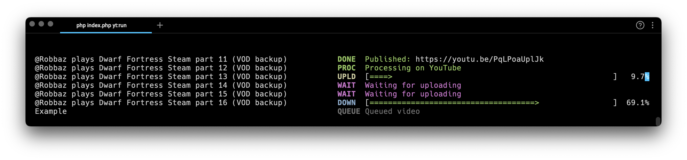

# Backup to YouTube CLI tool

### Features
- Download from almost any video hosting and upload to YouTube
- Support for partial video download
- Queue videos and run when you want
- Automatically resume upload and download, if interrupted
- You can set thumbnail, playlist, status (public,private,unlisted), tags, etc
- Free disk space checking, before downloading
- Automatic publishing when HD processing is finished

### Requirements
- PHP 8+
- [yt-dlp](https://github.com/yt-dlp/yt-dlp#installation) installed

### Usage
- Create a project on [Google Cloud](https://console.cloud.google.com/)
- Go to "APIs & Services" and create an OAuth token with type "Web application"
- Download the project code
- Replace client ID and client secret in the file `.env`
- Download [composer](https://getcomposer.org/download/) and run `composer install` in the project root folder
- Run `php index.php yt:auth` and follow the instructions
- Run `php index.php yt:queue` to add video to the queue
- Run `php index.php yt:run` to start the process

### Status
Please expect ton of bugs, since the code is in early stage. Sponsorship can speed up things ;)

If I have time I'll add easier installation for non-developers
